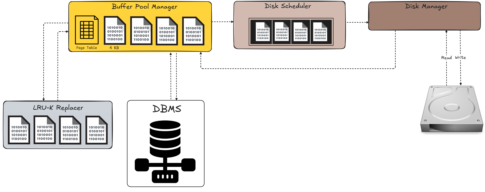

# Buffer Pool Manager


## Overview
This project implements a **Buffer Pool Manager** with **LRU-K page replacement** and a **Disk Scheduler** in Java. It manages memory pages, handles concurrency, and efficiently schedules disk I/O operations.


## Architecture

## Features
- **Buffer Pool Manager**: Manages fixed-size memory frames, acts as in-memory cache for read/write operations from disk.
- **LRU-K Replacement Policy**: Tracks the *K*-th most recent accesses for eviction decisions.
- **Disk Manager**: Handles reading and writing pages to the disk.
- **Disk Scheduler**: Manages I/O operations in a background worker thread.

## Installation
```sh
git clone https://github.com/yourusername/buffer-pool-manager.git
cd buffer-pool-manager
mvn clean install
